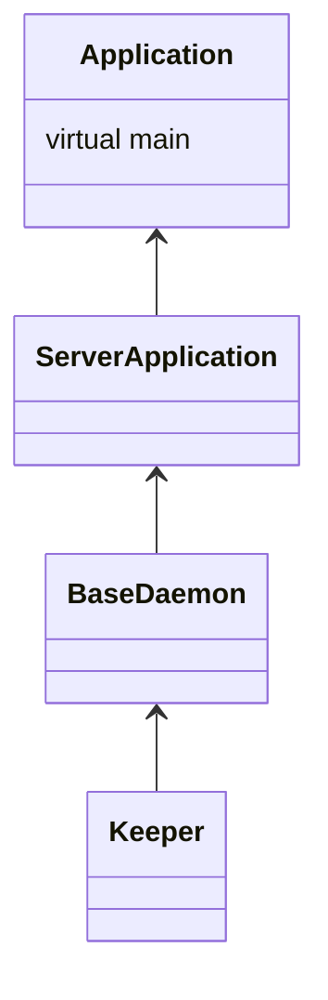

## 启动总入口函数

programs\main.cpp 为各种bin启动的总入口。keeper单独程序入口文件programs\keeper\keeper_main.cpp.

各种bin的**程序名与执行函数对**声明在clickhouse_applications中，其类型为std::pair<std::string_view, MainFunc>。

first_key为程序名，second_key为程序对应的函数指针。这里我们使用keeper程序单独部署keeper为例，所以走的是mainEntryClickHouseKeeper。

mainEntryClickHouseKeeper 定义在 programs\keeper\Keeper.cpp中，代码如下。

```
int mainEntryClickHouseKeeper(int argc, char ** argv)
{
    DB::Keeper app;

    try
    {
        return app.run(argc, argv);
    }
    catch (...)
    {
        std::cerr << DB::getCurrentExceptionMessage(true) << "\n";
        auto code = DB::getCurrentExceptionCode();
        return static_cast<UInt8>(code) ? code : 1;
    }
}
```

梳理总体框架如下：

```
mainEntryClickHouseKeeper	->
	Keeper::run()	->
		Application::run()	->
			Application::initialize()
			Keeper::main()
			Application::uninitialize()
```

关于为什么调到Keeper::main接口



Keeper::main()主要流程：

```
Context::initializeKeeperDispatcher()	->
	shared->keeper_dispatcher->initialize(...) / KeeperDispatcher::initialize()	->
		
```

